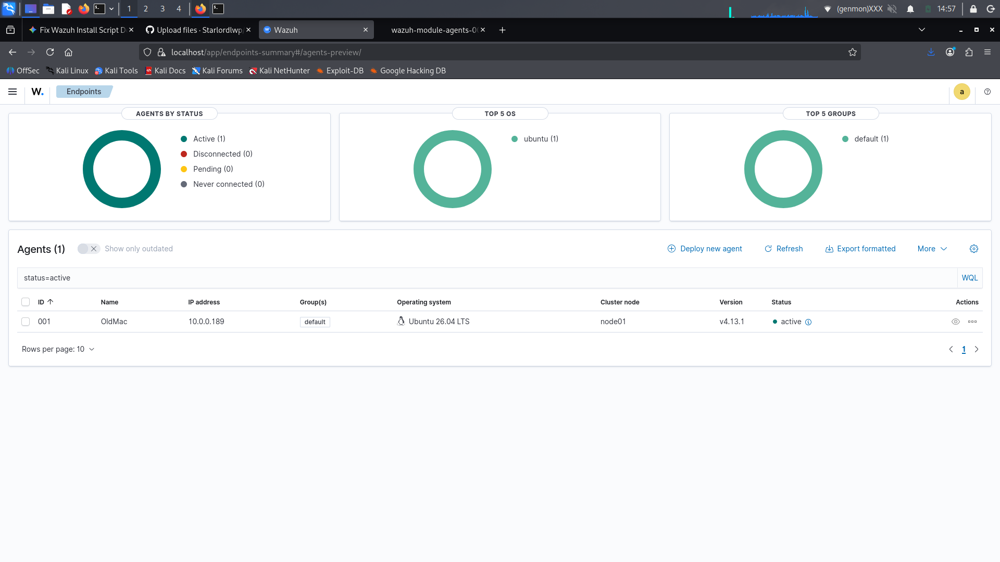
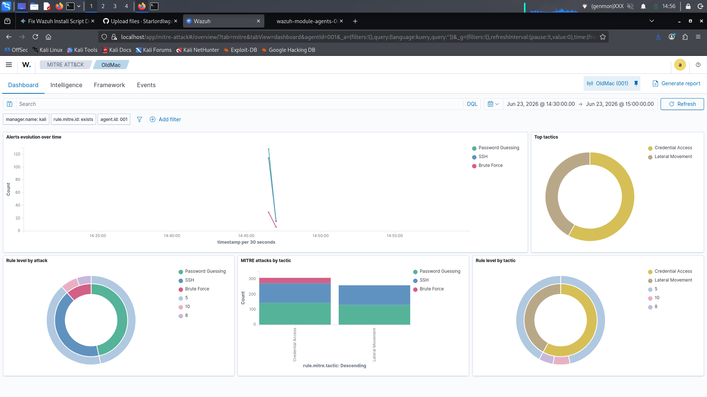

# Wazuh-SIEM-Home-Lab

##  Project Overview
This project demonstrates the deployment of an enterprise-grade Open-Source SIEM system using **Wazuh**. The lab consists of a Kali OS laptop hosting the centralized Wazuh Manager hosting the indexer and dashboard, alongside an Ubuntu OS Mac desktop with the remote endpoint running a lightweight Wazuh Agent for active security monitoring and log aggregation.

##  Architecture & Topology
* **SIEM Server (Manager, Indexer, Dashboard):** Kali Linux (`10.0.0.211`) running Wazuh v4.13.1
* **Monitored Endpoint (Agent):** Ubuntu (`OldMac`) running Wazuh Agent v4.13.1

##  Deployment Steps

### 1. Centralized Server Installation
The Wazuh server stack was deployed natively on a Kali Linux environment using the automated all-in-one installation assistant:

"curl -sO [https://packages.wazuh.com/4.13/wazuh-install.sh](https://packages.wazuh.com/4.13/wazuh-install.sh)"
"sudo bash wazuh-install.sh -a" 

## Lab Verification & Results

### Endpoint Connection Success
The screenshot below confirms that the remote Ubuntu endpoint (`OldMac`) successfully established a secure cryptographic handshake and is actively reporting telemetry back to the centralized Kali manager node:

### Threat Intelligence & MITRE ATT&CK Mapping
Wazuh natively maps aggregated logs against the MITRE ATT&CK framework. Below is a snapshot of the live dashboard compiling mapped alerts across various tactics and techniques (e.g., Persistence, Privilege Escalation):

   

###  Generated Compliance & Threat Reports
For deeper analysis, a comprehensive MITRE ATT&CK compliance report was compiled directly from the Wazuh executive engine. 

👉 **[Click here to view the full Wazuh MITRE PDF Report](./WazuhMitreReport.pdf)**
